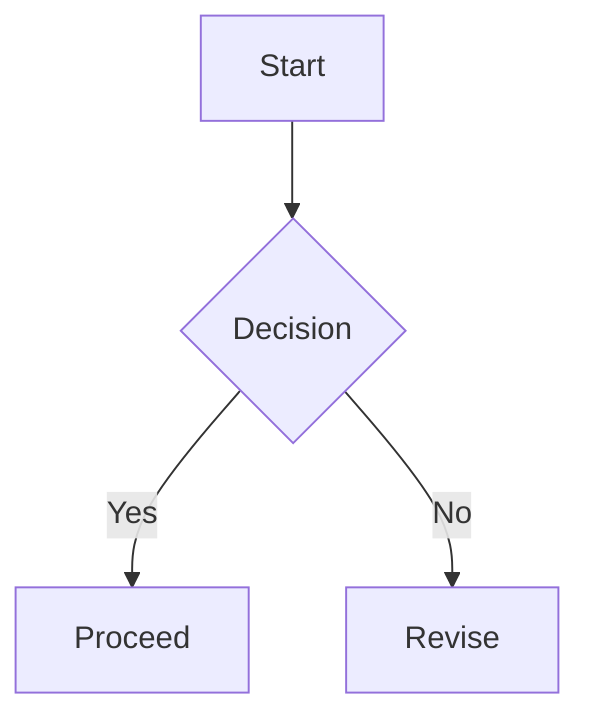

This is the final stress test for the renderer. It uses only tag-based blocks, with a calm, readable flow.

## Repeated Heading
This heading appears twice to confirm unique slug generation.

## Repeated Heading
The second instance must get a different id.

## Inline styles
- Bold: **bold text**
- Italic: *italic text*
- Strikethrough: ~~deprecated~~
- Inline code: `const answer = 42;`
- Link: [OpenAI](https://openai.com)

## Lists
Unordered:
- First
- Second
  - Nested item

Ordered:
1. Step one
2. Step two
3. Step three

Tasks:
- [x] Completed item
- [ ] Pending item

## Table
| Feature | Status | Note |
| --- | --- | --- |
| Table width | Auto | Should expand with content |
| Long cell | OK | This cell contains a longer description to test sizing |
| Mermaid | OK | SVG render |

## Code blocks
```ts
type User = {
  id: string;
  name: string;
};

export const greet = (user: User) => {
  return `Hello, ${user.name}!`;
};
```

Long line overflow test:
```
https://example.com/some/really/really/really/really/really/really/really/really/long/path?with=query&and=more
```

## Preview card (tag-based)
:::preview url="https://example.com" title="Example Domain" description="A short description that is clearly separate from body text."
https://example.com
:::

## Callouts (tag-based only)
:::note title="Note"
This is a note callout with a title.
:::

:::callout type=warning title="Policy" icon="warning"
This is a callout directive using explicit type and title.
:::

:::tip title="Tip"
Short tips are highlighted in a friendly tone.
:::

:::danger title="Danger"
This section flags destructive operations.
:::

:::info title="Info"
Neutral guidance for context and references.
:::

:::callout type=custom title="Custom colors" accent="#6D8FAF" bg="#E3EDF6" border="#6D8FAF" icon="info"
A custom callout that defines its own accent, background, and border colors.
:::

## Compare Block (tag-based)
:::compare
### Before
The earlier layout focused on dense lists and minimal imagery.

- Narrow reading width
- Minimal emphasis
- Limited callouts

<!-- compare -->

### After
The updated layout prioritizes breathing room, visuals, and clarity.

- Wider reading rhythm
- Rich callouts and previews
- Clear hierarchy with premium typography
:::

## Timeline Block (tag-based)
:::timeline
- [2026-01-24] Initial release of the new viewer layout.
- [2026-01-23] Added compare view and improved table styling.
- [2026-01-22] Fixed Mermaid theme and math rendering.
- [2026-01-21] Polished callouts, spoilers, and code blocks.
:::

## Spoiler (tag-based)
:::spoiler summary="Click to reveal"
Hidden content that is revealed on demand.
:::

## Gallery (tag-based)
:::gallery title="Gallery sample" autoplay=true interval=3200
https://placehold.co/1200x700/png | Wide cover
https://placehold.co/900x1200/png | Portrait sample

:::

## Mermaid


## Math
Inline math: $E=mc^2$ and $a^2+b^2=c^2$.

Block math:
$$
\int_0^\infty e^{-x} dx = 1
$$

## Image


## Blockquote
> A calm mind brings inner strength and self-confidence.

## Quote block (tag-based)
:::quote mark=">>" author="Meditations"
A dedicated quote block with a custom mark and author attribution.
:::

## Raw HTML
<div class="raw-html-block">
  <strong>Raw HTML</strong> is rendered via rehype-raw and sanitized by policy.
  <div class="raw-html-box">
    <span>Inline HTML elements still appear.</span>
    <svg viewBox="0 0 120 24" width="120" height="24" xmlns="http://www.w3.org/2000/svg">
      <path d="M2 12h116" stroke="currentColor" stroke-width="2" />
      <circle cx="12" cy="12" r="6" fill="currentColor" />
    </svg>
  </div>
</div>

## I18n blocks (tag-based)
:::i18n lang="en" id="greeting"
English block for the current language.
:::

:::i18n lang="ko" id="greeting"
Korean block for the current language.
:::

:::i18n lang="ja" id="greeting"
Japanese block for the current language.
:::

:::i18n lang="zh" id="greeting"
Chinese block for the current language.
:::

:::i18n lang="es" id="greeting"
Spanish block for the current language.
:::
