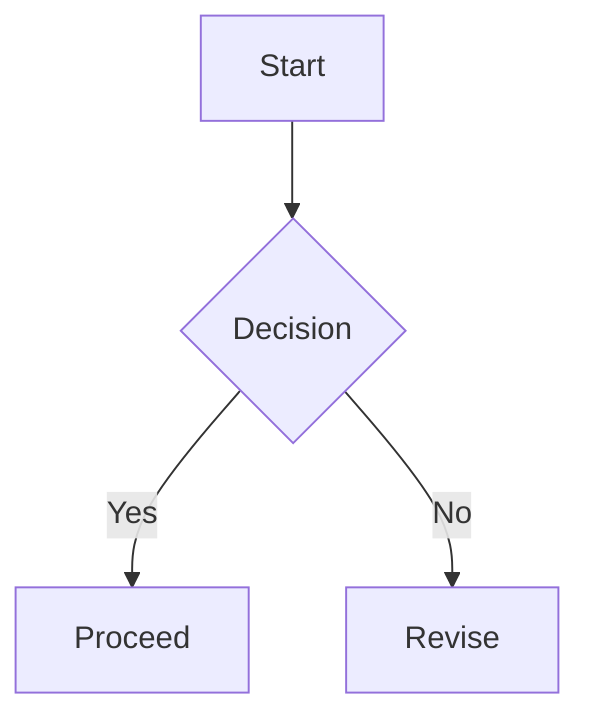

This guide is a comprehensive format test for the post viewer. It mixes inline styles, blocks, and custom directives to validate rendering.

## Repeated Heading
This heading appears twice to validate slug uniqueness.

## Repeated Heading
This second instance should receive a unique id.

## Inline styles
- Bold: **bold text**
- Italic: *italic text*
- Strikethrough: ~~deprecated~~
- Inline code: `const answer = 42;`
- Link: [OpenAI](https://openai.com)

## Lists
Unordered:
- First
- Second
  - Nested item

Ordered:
1. Step one
2. Step two
3. Step three

Tasks:
- [x] Completed item
- [ ] Pending item

## Table
| Feature | Status | Note |
| --- | --- | --- |
| Table width | Auto | Should expand with content |
| Long cell | OK | This cell contains a longer description to test sizing |
| Mermaid | OK | SVG render |

## Code blocks
```ts
type User = {
  id: string;
  name: string;
};

export const greet = (user: User) => {
  return `Hello, ${user.name}!`;
};
```

Long line overflow test:
```
https://example.com/some/really/really/really/really/really/really/really/really/long/path?with=query&and=more
```

Preview card:
:::preview url="https://example.com"
https://example.com
:::

## Callouts
:::note title="Note"
This is a note callout with a title.
:::

:::callout type=warning title="Policy"
This is a callout directive using explicit type and title.
:::

:::tip title="Tip"
Short tips are highlighted in a friendly tone.
:::

:::danger title="Danger"
This section flags destructive operations.
:::

## Spoiler
:::spoiler summary="Click to reveal"
Hidden content that is revealed on demand.
:::

## Mermaid


## Math
Inline math: $E=mc^2$ and $a^2+b^2=c^2$.

Block math:
$$
\\int_0^\\infty e^{-x} dx = 1
$$

## Image


## Blockquote
> A calm mind brings inner strength and self-confidence.

## Raw HTML
<div class="raw-html-block">
  <strong>Raw HTML</strong> is rendered via rehype-raw and sanitized by policy.
</div>

## I18n blocks
:::i18n lang="en" id="greeting"
English block for the current language.
:::

:::i18n lang="ko" id="greeting"
Korean block for the current language.
:::

<i18n-block lang="ja" data-i18n-id="greeting">
Japanese block rendered from raw HTML.
</i18n-block>
