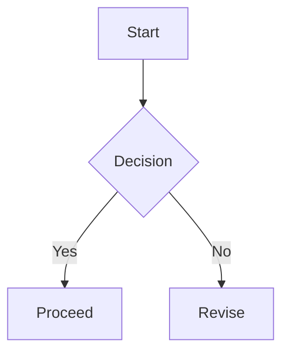

Esta es la prueba final del renderizador. Todo se activa solo con bloques basados en etiquetas.

## Encabezado repetido
Este encabezado aparece dos veces para verificar los slugs ?nicos.

## Encabezado repetido
La segunda instancia debe tener un id distinto.

## Estilos en linea
- Negrita: **texto en negrita**
- Cursiva: *texto en cursiva*
- Tachado: ~~deprecated~~
- Codigo en linea: `const answer = 42;`
- Enlace: [OpenAI](https://openai.com)

## Listas
Sin orden:
- Primero
- Segundo
  - Subitem

Ordenada:
1. Paso uno
2. Paso dos
3. Paso tres

Tareas:
- [x] Hecho
- [ ] Pendiente

## Tabla
| Funcion | Estado | Nota |
| --- | --- | --- |
| Ancho | Auto | Debe crecer con el contenido |
| Celda larga | OK | Prueba de textos extensos |
| Mermaid | OK | Render SVG |

## Bloques de codigo
```ts
type User = {
  id: string;
  name: string;
};

export const greet = (user: User) => {
  return `Hello, ${user.name}!`;
};
```

Prueba de linea larga:
```
https://example.com/some/really/really/really/really/really/really/really/really/long/path?with=query&and=more
```

## Tarjeta de vista previa (etiqueta)
:::preview url="https://example.com" title="Example Domain" description="Descripcion breve claramente separada del texto."
https://example.com
:::

## Callouts (etiquetas)
:::note title="Nota"
Ejemplo de nota con titulo.
:::

:::callout type=warning title="Politica" icon="warning"
Callout con tipo y titulo explicitos.
:::

:::tip title="Tip"
Un tip corto en tono amable.
:::

:::danger title="Peligro"
Advertencia para operaciones destructivas.
:::

:::info title="Info"
Informacion neutral de contexto.
:::

:::callout type=custom title="Colores personalizados" accent="#6D8FAF" bg="#E3EDF6" border="#6D8FAF" icon="info"
Callout con colores e icono personalizados.
:::

## Bloque de comparacion (etiqueta)
:::compare
### Antes
El diseno anterior era mas denso y con menos imagenes.

- Ancho de lectura limitado
- Menos enfasis
- Callouts limitados

<!-- compare -->

### Despues
El nuevo diseno prioriza aire, imagenes y jerarquia.

- Ritmo de lectura mas amplio
- Callouts y previews ricos
- Jerarquia clara
:::

## Timeline (etiqueta)
:::timeline
- [2026-01-24] Lanzamiento inicial del nuevo visor.
- [2026-01-23] Vista de comparacion y mejoras en tablas.
- [2026-01-22] Correcciones de Mermaid y matematicas.
- [2026-01-21] Ajustes en callouts, spoilers y codigo.
:::

## Spoiler (etiqueta)
:::spoiler summary="Mostrar contenido"
Contenido oculto hasta que el lector lo solicite.
:::

## Galeria (etiqueta)
:::gallery title="Galeria de muestra" autoplay=true interval=3200
https://placehold.co/1200x700/png | Portada amplia
https://placehold.co/900x1200/png | Muestra vertical

:::

## Mermaid


## Matematicas
Inline: $E=mc^2$ y $a^2+b^2=c^2$.

Bloque:
$$
\int_0^\infty e^{-x} dx = 1
$$

## Imagen


## Cita
> Una mente calmada aporta fuerza interior y confianza.

## Bloque de cita (etiqueta)
:::quote mark=">>" author="Meditaciones"
Bloque de cita con marca y autor.
:::

## Raw HTML
<div class="raw-html-block">
  <strong>Raw HTML</strong> se renderiza con rehype-raw y se limpia segun la politica.
  <div class="raw-html-box">
    <span>Los elementos HTML en linea tambien se muestran.</span>
    <svg viewBox="0 0 120 24" width="120" height="24" xmlns="http://www.w3.org/2000/svg">
      <path d="M2 12h116" stroke="currentColor" stroke-width="2" />
      <circle cx="12" cy="12" r="6" fill="currentColor" />
    </svg>
  </div>
</div>

## Bloques I18n (etiqueta)
:::i18n lang="en" id="greeting"
Bloque en ingles.
:::

:::i18n lang="ko" id="greeting"
Bloque en coreano.
:::

:::i18n lang="ja" id="greeting"
Bloque en japones.
:::

:::i18n lang="zh" id="greeting"
Bloque en chino.
:::

:::i18n lang="es" id="greeting"
Bloque en espanol.
:::
