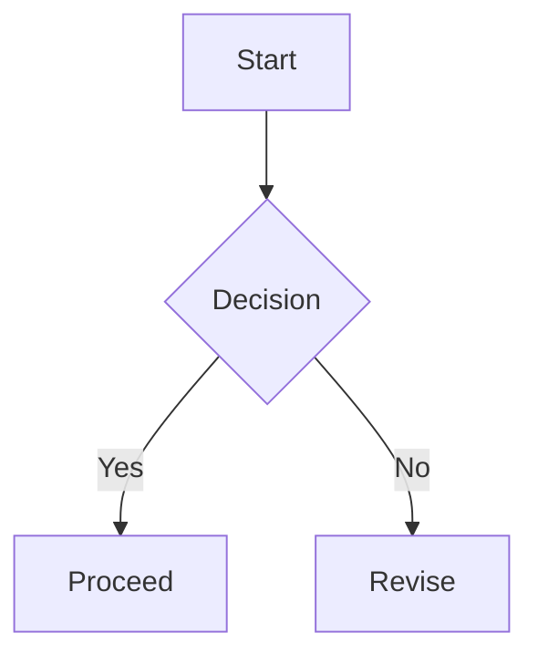

Este documento es una **prueba de formato** para el visor. Incluye estilos, `codigo`, tablas y diagramas.

## Estilos en linea
- Bold: **bold text**
- Italic: *italic text*
- Strikethrough: ~~deprecated~~
- Inline code: `const answer = 42;`
- Link: [OpenAI](https://openai.com)

## Listas
Unordered:
- First
- Second
  - Nested item

Ordered:
1. Step one
2. Step two
3. Step three

Tasks:
- [x] Completed item
- [ ] Pending item

## Tabla
| Feature | Status | Note |
| --- | --- | --- |
| Table scroll | OK | horizontal overflow |
| Code block | OK | syntax highlight |
| Mermaid | OK | svg render |

## Bloques de codigo
```ts
type User = {
  id: string;
  name: string;
};

export const greet = (user: User) => {
  return `Hello, ${user.name}!`;
};
```

Long line overflow test:
```
https://example.com/some/really/really/really/really/really/really/really/really/long/path?with=query&and=more
```

Preview card:
```preview
https://example.com
```

## Callouts
:::note title="Note"
This is a note callout with a title.
:::

:::tip title="Tip"
Short tips are highlighted in a friendly tone.
:::

:::warning title="Warning"
Be careful with changes that affect layout.
:::

:::danger title="Danger"
This section flags destructive operations.
:::

:::info title="Info"
Extra context that does not fit inline.
:::

## Spoiler
:::spoiler summary="Click to reveal"
Hidden content that is revealed on demand.
:::

## Mermaid


## Matematicas
Inline math: $E=mc^2$ and $a^2+b^2=c^2$.

Block math:
$$
\\int_0^\\infty e^{-x} dx = 1
$$

## Imagen


## Cita
> A calm mind brings inner strength and self-confidence.

## Raw HTML
<div style="padding:12px;border:1px dashed #999;border-radius:12px;background:#faf7f2;">
  Inline HTML block to test rehype-raw.
</div>

## Bloque I18n
:::i18n id=hero
This block is tagged for synchronized updates across languages.
:::
