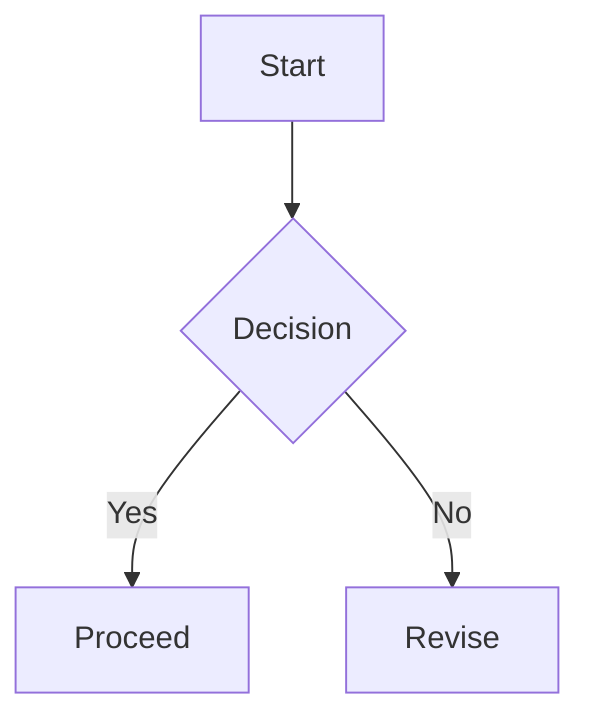

???? ????? ????? ???? ?? ?? ???? ??????. ?? ??? ??? ?? ?? ????? ??????.

## ?? ??
? ??? ? ? ??? ???? ????? ?????.

## ?? ??
? ?? ??? ?? id? ??? ???.

## ??? ???
- ??: **?? ??**
- ???: *??? ??*
- ???: ~~deprecated~~
- ??? ??: `const answer = 42;`
- ??: [OpenAI](https://openai.com)

## ???
?? ?? ??:
- ? ??
- ? ??
  - ?? ???

?? ?? ??:
1. ? ??
2. ? ?? ??
3. ? ?? ??

?????:
- [x] ?? ??
- [ ] ?? ??

## ?
| ?? | ?? | ?? |
| --- | --- | --- |
| ??? ? | ?? | ??? ?? ????? ? |
| ? ? | OK | ??? ? ??? ?? ??? |
| Mermaid | OK | SVG ?? ?? |

## ?? ??
```ts
type User = {
  id: string;
  name: string;
};

export const greet = (user: User) => {
  return `Hello, ${user.name}!`;
};
```

? ? ???? ???:
```
https://example.com/some/really/really/really/really/really/really/really/really/long/path?with=query&and=more
```

## ??? ?? (?? ??)
:::preview url="https://example.com" title="Example Domain" description="??? ???? ?? ??? ?????."
https://example.com
:::

## ??? (?? ??)
:::note title="??"
??? ?? ?? ??? ?????.
:::

:::callout type=warning title="??" icon="warning"
??? ??? ??? ??????.
:::

:::tip title="?"
?? ?? ??? ??? ?????.
:::

:::danger title="??"
???? ??? ?????.
:::

:::info title="??"
?? ??? ?? ??? ?????.
:::

:::callout type=custom title="??? ??" accent="#6D8FAF" bg="#E3EDF6" border="#6D8FAF" icon="info"
??? ??? ???? ??? ??????.
:::

## ?? ?? (?? ??)
:::compare
### ??
?? ????? ??? ??? ?? ?? ??? ??????.

- ?? ?? ?
- ?? ???
- ??? ???

<!-- compare -->

### ??
? ????? ??, ???, ??? ?????.

- ??? ?? ??
- ??? ???? ???
- ??? ??? ??
:::

## ???? ?? (?? ??)
:::timeline
- [2026-01-24] ? ?? ???? ?? ??.
- [2026-01-23] ?? ?? ??? ??? ??.
- [2026-01-22] Mermaid ??? ?? ?? ??.
- [2026-01-21] ???, ????, ?? ?? ??.
:::

## ???? (?? ??)
:::spoiler summary="?? ??"
??? ?? ??? ?????.
:::

## ??? (?? ??)
:::gallery title="??? ??" autoplay=true interval=3200
https://placehold.co/1200x700/png | ??? ??
https://placehold.co/900x1200/png | ?? ??

:::

## Mermaid


## ??
??? ??: $E=mc^2$ ? $a^2+b^2=c^2$.

?? ??:
$$
\int_0^\infty e^{-x} dx = 1
$$

## ???


## ??
> ??? ??? ??? ?? ???? ?????.

## ?? ?? (?? ??)
:::quote mark=">>" author="???"
??? ?? ??? ??? ??? ?????.
:::

## Raw HTML
<div class="raw-html-block">
  <strong>Raw HTML</strong> ? rehype-raw? ???? ??? ?? ?????.
  <div class="raw-html-box">
    <span>??? HTML ??? ?????.</span>
    <svg viewBox="0 0 120 24" width="120" height="24" xmlns="http://www.w3.org/2000/svg">
      <path d="M2 12h116" stroke="currentColor" stroke-width="2" />
      <circle cx="12" cy="12" r="6" fill="currentColor" />
    </svg>
  </div>
</div>

## I18n ?? (?? ??)
:::i18n lang="en" id="greeting"
?? ?????.
:::

:::i18n lang="ko" id="greeting"
??? ?????.
:::

:::i18n lang="ja" id="greeting"
??? ?????.
:::

:::i18n lang="zh" id="greeting"
??? ?????.
:::

:::i18n lang="es" id="greeting"
???? ?????.
:::
