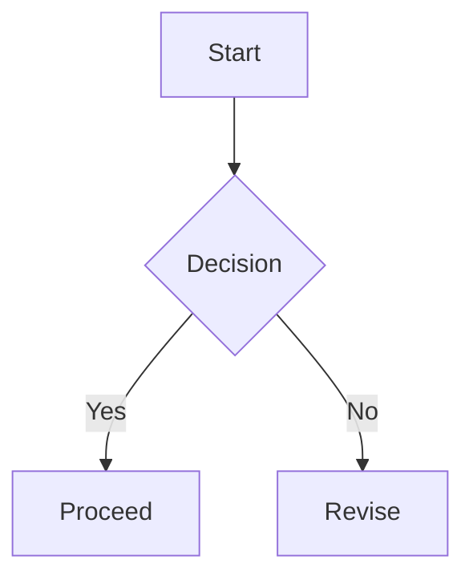

이 문서는 포스트 뷰어의 렌더링을 검증하기 위한 **포맷 테스트**입니다. 강조, `코드`, 표, 도표 등을 포함합니다.

## 인라인 스타일
- 굵게: **bold text**
- 기울임: *italic text*
- 취소선: ~~deprecated~~
- 인라인 코드: `const answer = 42;`
- 링크: [OpenAI](https://openai.com)

## 리스트
Unordered:
- First
- Second
  - Nested item

Ordered:
1. Step one
2. Step two
3. Step three

Tasks:
- [x] Completed item
- [ ] Pending item

## 테이블
| Feature | Status | Note |
| --- | --- | --- |
| Table scroll | OK | horizontal overflow |
| Code block | OK | syntax highlight |
| Mermaid | OK | svg render |

## 코드 블록
```ts
type User = {
  id: string;
  name: string;
};

export const greet = (user: User) => {
  return `Hello, ${user.name}!`;
};
```

Long line overflow test:
```
https://example.com/some/really/really/really/really/really/really/really/really/long/path?with=query&and=more
```

Preview card:
```preview
https://example.com
```

## 콜아웃
:::note title="Note"
This is a note callout with a title.
:::

:::tip title="Tip"
Short tips are highlighted in a friendly tone.
:::

:::warning title="Warning"
Be careful with changes that affect layout.
:::

:::danger title="Danger"
This section flags destructive operations.
:::

:::info title="Info"
Extra context that does not fit inline.
:::

## 스포일러
:::spoiler summary="Click to reveal"
Hidden content that is revealed on demand.
:::

## Mermaid


## 수식
Inline math: $E=mc^2$ and $a^2+b^2=c^2$.

Block math:
$$
\\int_0^\\infty e^{-x} dx = 1
$$

## 이미지


## 인용문
> A calm mind brings inner strength and self-confidence.

## Raw HTML
<div style="padding:12px;border:1px dashed #999;border-radius:12px;background:#faf7f2;">
  Inline HTML block to test rehype-raw.
</div>

## I18n 블록
:::i18n id=hero
This block is tagged for synchronized updates across languages.
:::
