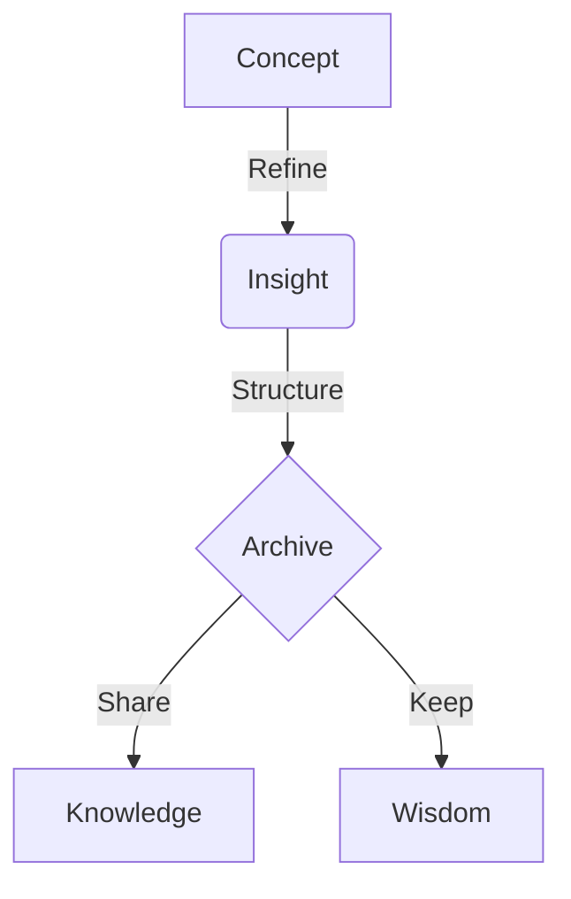

Welcome to the **Archive**. This space is designed not just for storing text, but for **preserving insight**. This guide serves as a blueprint for structuring your knowledge effectively.

## 1. The Foundation (Frontmatter)

Every piece of knowledge begins with metadata. At the very top of your `.md` file, define the essence of your writing.

```yaml
---
title: "The Essence of Gravity"  # The main subject
description: "Exploring the fundamental forces..." # A brief summary for the preview
date: 2026-01-24                 # YYYY-MM-DD format
tags: [physics, nature]          # Keywords for categorization
type: post                       # 'post', 'notice', or 'changelog'
pinned: false                    # Set to 'true' to feature this in the Spotlight
---
```

---

## 2. Structural Elements

Use standard Markdown to create hierarchy and flow.

### Typography
*   **Emphasis**: Use **bold** for core concepts and *italics* for nuance.
*   **Lists**: Organize thoughts with bullet points.
*   **Quotes**: Use blockquotes for citations.

> "Simplicity is the ultimate sophistication." — Leonardo da Vinci

---

## 3. Visualizing Logic (Mermaid)

Complex systems are best understood visually. We support **Mermaid** diagrams to render flowcharts, sequence diagrams, and more.



---

## 4. Mathematical Precision (KaTeX)

For scientific and engineering verification, precision is key. Use **KaTeX** for beautiful mathematical notation.

**Inline Math:** The energy equation is $E = mc^2$.

**Block Math:**
$$
\int_{-\infty}^{\infty} e^{-x^2} dx = \sqrt{\pi}
$$

---

## 5. Architectural Components (Callouts)

Highlight critical information or provide context without breaking the flow.

:::note
**Note**
This is a standard note for general information.
:::

:::tip
**Pro Tip**
Use tips to provide shortcuts or deeper insights.
:::

:::warning
**Caution**
Highlight potential pitfalls or critical warnings here.
:::

---

## 6. Hidden Depths (Spoilers)

Sometimes, details should be revealed only when requested. Use spoilers for answers or extended details.

:::details[Click to reveal the answer]
The answer lies in the question itself. Verification is the path to mastery.
:::

---

**Craft your legacy.** The Archive awaits your insights.
