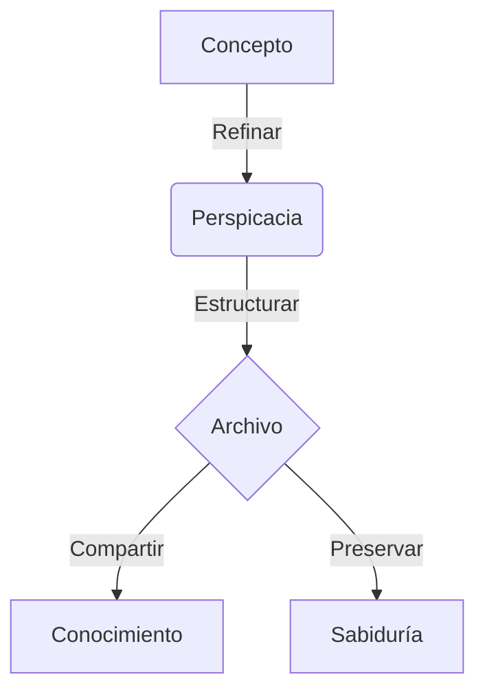

Bienvenido al **Archivo**. Este espacio está diseñado no solo para almacenar texto, sino para **preservar la perspicacia**. Esta guía sirve como plano para estructurar su conocimiento de manera efectiva.

## 1. Los Cimientos (Frontmatter)

Cada pieza de conocimiento comienza con metadatos. En la parte superior de su archivo `.md`, defina la esencia de su escrito.

```yaml
---
title: "La Esencia de la Gravedad" # El tema principal
description: "Explorando las fuerzas fundamentales..." # Un breve resumen
date: 2026-01-24                   # Formato AAAA-MM-DD
tags: [física, naturaleza]         # Palabras clave
type: post                         # 'post', 'notice' (aviso), o 'changelog'
pinned: false                      # Establecer en 'true' para destacar en Spotlight
---
```

---

## 2. Elementos Estructurales

Utilice Markdown estándar para crear jerarquía y flujo.

### Tipografía
*   **Énfasis**: Use **negrita** para conceptos centrales y *cursiva* para matices.
*   **Listas**: Organice pensamientos con viñetas.
*   **Citas**: Use bloques de citas para referencias.

> "La simplicidad es la máxima sofisticación." — Leonardo da Vinci

---

## 3. Visualizando la Lógica (Mermaid)

Los sistemas complejos se entienden mejor visualmente. Soportamos diagramas **Mermaid** para renderizar flujos, secuencias y más.



---

## 4. Precisión Matemática (KaTeX)

Para la verificación científica y de ingeniería, la precisión es clave. Use **KaTeX** para una notación matemática hermosa.

**Matemática en línea:** La ecuación de energía es $E = mc^2$.

**Bloque matemático:**
$$
\int_{-\infty}^{\infty} e^{-x^2} dx = \sqrt{\pi}
$$

---

## 5. Componentes Arquitectónicos (Callouts)

Destaque información crítica o proporcione contexto sin romper el flujo.

:::note
**Nota**
Esta es una nota estándar para información general.
:::

:::tip
**Consejo**
Use consejos para proporcionar atajos o conocimientos más profundos.
:::

:::warning
**Precaución**
Destaque posibles errores o advertencias críticas aquí.
:::

---

## 6. Profundidades Ocultas (Spoilers)

A veces, los detalles deben revelarse solo cuando se solicitan. Use spoilers para respuestas o detalles extendidos.

:::details[Clic para revelar la respuesta]
La respuesta yace en la pregunta misma. La verificación es el camino a la maestría.
:::

---

**Elabore su legado.** El Archivo espera sus conocimientos.
