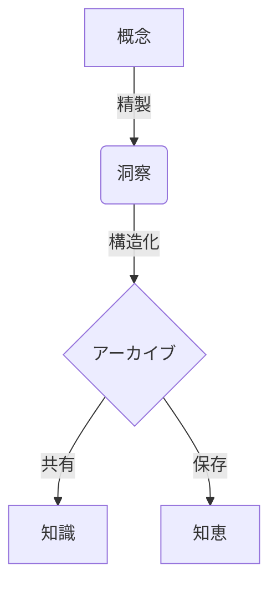

**アーカイブ**へようこそ。ここは単なるテキストの羅列ではなく、**洞察の保存**のための空間です。このガイドは、あなたの知識を最も優雅かつ構造的に記録する方法を案内します。

## 1. 定礎 (Frontmatter)

すべての記録はメタデータから始まります。`.md`ファイルの最上部に、この文章の本質を定義してください。

```yaml
---
title: "重力の本質について"      # タイトル
description: "基本的な力の原理を探求します。" # リストに表示される要約
date: 2026-01-24                 # 日付 (YYYY-MM-DD)
tags: [物理学, 自然]             # タグ
type: post                       # 'post'(一般), 'notice'(お知らせ), 'changelog'(更新)
pinned: false                    # 'true'に設定するとスポットライトセクションに固定されます。
---
```

---

## 2. 構造の美学 (Structure)

標準マークダウンを使用して、文章の階層と流れを作ります。

### タイポグラフィ
*   **強調**: 核心概念は**太字**、ニュアンスは*斜体*で表現します。
*   **リスト**: 思考を点や数字で整理します。
*   **引用**: 他者の洞察を借りる際は引用符を使用します。

> 「単純さは究極の洗練である。」 — レオナルド・ダ・ヴィンチ

---

## 3. 論理の可視化 (Mermaid)

複雑なシステムは視覚的に表現することで最も明確になります。**Mermaid**を使用してフローチャートやダイアグラムを描いてみてください。



---

## 4. 数学的精密さ (KaTeX)

科学的および工学的検証のために、精密な数式表記をサポートします。**KaTeX**文法を活用してください。

**インライン数式:** エネルギー等価式は $E = mc^2$ です。

**ブロック数式:**
$$
\int_{-\infty}^{\infty} e^{-x^2} dx = \sqrt{\pi}
$$

---

## 5. 建築的要素 (Callouts)

流れを壊さずに重要な情報を強調したり、文脈を補足したりします。

:::note
**参考**
一般的な情報を伝える際に使用するノートです。
:::

:::tip
**ヒント**
近道やより深い洞察を提供する際に使用します。
:::

:::warning
**注意**
潜在的なエラーや重要な警告事項を強調します。
:::

---

## 6. 隠された深み (Spoilers)

時には詳細な内容や正解を隠しておく必要があります。

:::details[正解を確認する]
解は問いの中にあります。検証はマスタリーへの道です。
:::

---

**あなたの遺産を設計してください。** アーカイブはあなたの洞察を待っています。
