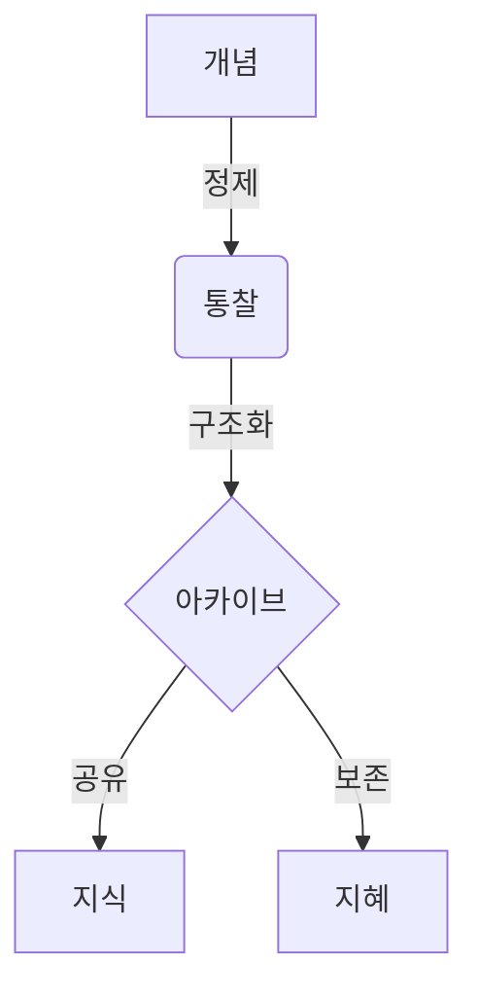

**아카이브**에 오신 것을 환영합니다. 이곳은 단순한 텍스트의 나열이 아닌, **통찰의 보존**을 위한 공간입니다. 이 가이드는 당신의 지식을 가장 우아하고 구조적으로 기록하는 방법을 안내합니다.

## 1. 초석 다지기 (Frontmatter)

모든 기록은 메타데이터로부터 시작됩니다. `.md` 파일의 최상단에 이 글의 본질을 정의해 주세요.

```yaml
---
title: "중력의 본질에 관하여"    # 제목
description: "기본적인 힘의 원리를 탐구합니다." # 목록에 표시될 요약
date: 2026-01-24                 # 날짜 (YYYY-MM-DD)
tags: [물리학, 자연]             # 태그
type: post                       # 'post'(일반), 'notice'(공지), 'changelog'(업데이트)
pinned: false                    # 'true'로 설정 시 스포트라이트 섹션에 고정됩니다.
---
```

---

## 2. 구조의 미학 (Structure)

표준 마크다운을 사용하여 글의 위계와 흐름을 만듭니다.

### 타이포그래피
*   **강조**: 핵심 개념은 **굵게**, 뉘앙스는 *기울임꼴*로 표현합니다.
*   **목록**: 생각을 점이나 숫자로 정리합니다.
*   **인용**: 타인의 통찰을 빌려올 때는 인용구를 사용합니다.

> "단순함은 궁극의 정교함이다." — 레오나르도 다 빈치

---

## 3. 논리의 시각화 (Mermaid)

복잡한 시스템은 시각적으로 표현할 때 가장 명확합니다. **Mermaid**를 사용하여 흐름도와 다이어그램을 그려보세요.



---

## 4. 수학적 정밀함 (KaTeX)

과학과 공학적 검증을 위해 정밀한 수식 표기를 지원합니다. **KaTeX** 문법을 활용하세요.

**인라인 수식:** 에너지 등가 공식은 $E = mc^2$ 입니다.

**블록 수식:**
$$
\int_{-\infty}^{\infty} e^{-x^2} dx = \sqrt{\pi}
$$

---

## 5. 건축적 요소 (Callouts)

흐름을 깨지 않으면서도 중요한 정보를 강조하거나 맥락을 더합니다.

:::note
**참고**
일반적인 정보를 전달할 때 사용하는 노트입니다.
:::

:::tip
**팁**
지름길이나 더 깊은 통찰을 제공할 때 사용합니다.
:::

:::warning
**주의**
잠재적인 오류나 중요한 경고 사항을 강조합니다.
:::

---

## 6. 숨겨진 깊이 (Spoilers)

때로는 상세한 내용이나 정답을 숨겨두어야 할 때가 있습니다.

:::details[정답 확인하기]
해답은 질문 안에 있습니다. 검증은 마스터리로 가는 길입니다.
:::

---

**당신의 유산을 설계하세요.** 아카이브는 당신의 통찰을 기다리고 있습니다.
