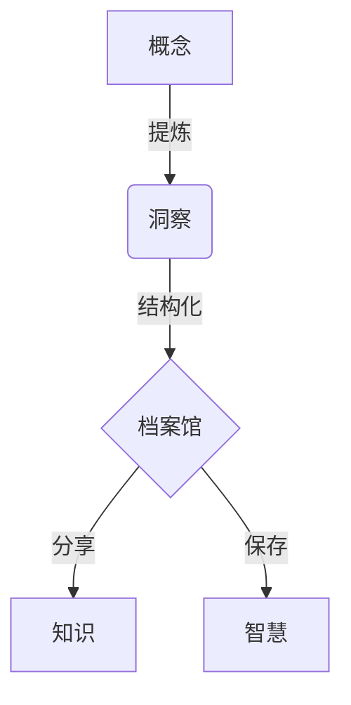

欢迎来到**档案馆**。这里不仅是存储文字的空间，更是**保存洞察**的场所。本指南将为您提供蓝图，帮助您以最优雅、最结构化的方式记录知识。

## 1. 奠定基石 (Frontmatter)

每一条记录都始于元数据。请在 `.md` 文件的最顶端定义本文的本质。

```yaml
---
title: "关于重力的本质"          # 标题
description: "探索基本力的原理。" # 列表中显示的摘要
date: 2026-01-24                 # 日期 (YYYY-MM-DD)
tags: [物理学, 自然]             # 标签
type: post                       # 'post'(文章), 'notice'(公告), 'changelog'(更新日志)
pinned: false                    # 设置为 'true' 以在焦点区域置顶
---
```

---

## 2. 结构之美 (Structure)

使用标准 Markdown 来构建文章的层级与流畅度。

### 排版
*   **强调**：核心概念使用**粗体**，细微差别使用*斜体*。
*   **列表**：使用圆点或数字整理思绪。
*   **引用**：引用他人的洞察时使用引用块。

> “简约是极致的复杂。” — 莱昂纳多·达·芬奇

---

## 3. 逻辑可视化 (Mermaid)

复杂的系统通过视觉化表达最为清晰。我们支持 **Mermaid** 图表来绘制流程图、序列图等。



---

## 4. 数学精度 (KaTeX)

为了科学与工程验证，精度至关重要。请使用 **KaTeX** 进行优美的数学符号表达。

**行内公式：** 质能方程为 $E = mc^2$。

**块级公式：**
$$
\int_{-\infty}^{\infty} e^{-x^2} dx = \sqrt{\pi}
$$

---

## 5. 建筑元素 (Callouts)

在不打断阅读流畅度的情况下，强调关键信息或补充背景。

:::note
**参考**
用于传达一般信息的笔记。
:::

:::tip
**提示**
用于提供捷径或更深层的见解。
:::

:::warning
**注意**
强调潜在的陷阱或重要的警告事项。
:::

---

## 6. 隐藏的深度 (Spoilers)

有时，细节或答案需要被折叠隐藏。

:::details[点击查看答案]
答案就在问题之中。验证是通往精通之路。
:::

---

**构建您的遗产。** 档案馆期待您的洞察。
